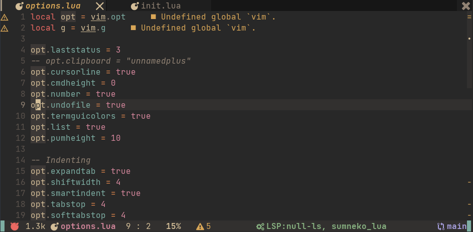

# nv4me
NvChad-like config for my personal use.  
This is a personal config that can use plugin formats and other easy-to-maintain mechanisms.  
The aim is to be easy to control in all settings.  

